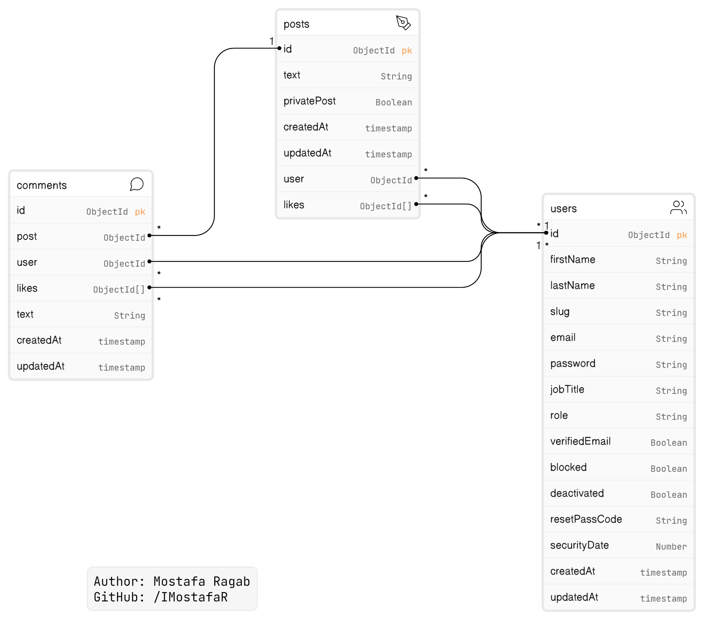

# social-media-node-js

 

# Table of Contents

1. [Introduction](#introduction)
2. [Database Analysis](#database-analysis)

3. [Author](#author)

# Introduction

This is my work during learning backend web development.

This is an social-media-Node.js application built with Express.js, Mongoose, and MongoDB, following the MVC (Model-View-Controller) design pattern.

# Database Analysis

---

## Author

- GitHub - [IMostafaR](https://github.com/IMostafaR)
- Linkedin - [@imostafarh](https://www.linkedin.com/in/imostafarh/)
